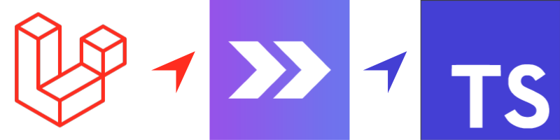

# Laravel Inertia TS Stack

## About This Stack

This minimal featured modern monolith web starter kit boilerplate aims to have ready-to-go dev stack with high enterprise quality standing requirements.

### Technologies involved

- **Laravel 8** and **PHP 8.0** as minimum requirement. It allows usage of **PHP attributes** which notably is perfect for routes definition inside controllers as Symfony does.
- Usage of **[Vite](https://vitejs.dev/)** as main frontend tooling for instant start and HMR development thanks to modern [esbuild bundler](https://github.com/evanw/esbuild).
- **[Windi CSS](https://windicss.org/)** as main CSS framework for both front and admin parts.
- Front is ready to go for full **blade + livewire + AlpineJS** integration. Perfect for SEO based websites. It's configured with Windi CSS but you can easily switch to another framework.
- Basic admin UI fully build with **[Inertia](https://inertiajs.com/) + Windi CSS + Vue 3 Typescript with composition API**. Thanks to Inertia for get rid of Vue Router boilerplate to typescript for instant IDE feedbacks !

#### Why Windi CSS ?

It's fully written in Typescript and 100% compatible with Tailwind 2.x API. It has perfect integration with Vite + Typescript combo. Besides it's JIT from the ground up, which is ideal for HMR development. If you come from Tailwind, don't worry, nothing will really change for you and yes, it has dedicated plugin for [VSCode](https://windicss.org/editors/vscode.html).

### Features

Only simple basic features :

- Empty and easily removable front part, prepared with livewire and AlpineJS.
- Admin UI Layout with all **basic auth pages** (login / register / reset password / profile) and **users management with impersonation**. All credits goes to [Laravel Jetstream](https://jetstream.laravel.com) and [Ping CRM](https://github.com/inertiajs/pingcrm).
- Clear separation between front and admin parts, with dedicated folders for controllers and resources and separated Vite configs. It's really simple to remove front part if you need only admin for CRM based application. **CSS purge and CSS build** is properly configured for each front and admin part.
- Admin RAD mini framework similar to [React Admin](https://marmelab.com/react-admin/) with ready to use **crud pages**, **data table**, **fields** and **form inputs**. **Quick aside panel** view/edit with real inertia routing context is also supported and actually used for users management in this boilerplate !
- Extensible **DataTable** component with **paging**, **sorting**, **global search**, **by column filter**, **template columns**, **customizable row actions**, **excel export** features. All that with efficient nice dev API !
- Backend is fully tested project by using [Pest](https://pestphp.com/) testing framework with **100% code coverage**, which gives you a perfect starting dev point if you want to go with **TDD** in mind.

### Backend Packages

- [Laravel Fortify](https://github.com/laravel/fortify) for ready to used backend authentication endpoints.
- [Spatie Route Attributes](https://github.com/spatie/laravel-route-attributes) for direct routes definition inside controllers. No more heavy routes files !
- [Ziggy](https://github.com/tighten/ziggy) for Laravel routes names definitions accessible from client side.
- [Matice](https://github.com/GENL/matice) for nice Laravel translations integration within client side.
- [Laravel Excel](https://laravel-excel.com/) as perfect solution for data table Excel export.
- [Spatie Laravel Enum](https://github.com/spatie/laravel-enum) for proper enum support.
- [Spatie Query Builder](https://github.com/spatie/laravel-query-builder) as nice Eloquent builder for API REST resources browsing, totally bridged inside above **DataTable** component.

### Advanced dev tools for high quality standard

#### Backend dev tools

- [Clockwork](https://github.com/itsgoingd/clockwork) for advanced profiling with debugbar and frontend metrics enabled. Can show N+1 query problems.
- [Laravel IDE Helper](https://github.com/barryvdh/laravel-ide-helper) for proper autocompletion, compatible with PHPStorm and VSCode Intelephense
- [PHP CS Fixer 3](friendsofphp/php-cs-fixer) configured for Laravel default styling. Use it with this [VSCode plugin](https://github.com/junstyle/vscode-php-cs-fixer) for proper formatting on save.
- [Larastan](https://github.com/nunomaduro/larastan) for static PHP code analysis.
- [Pest](https://pestphp.com/) as enjoyable testing API.

#### Frontend dev tools

- Prettier code formatting
- Eslint for typescript linting

## Usage

### VSCode configuration

### Advices

This stack is perfect for real RAD development while keeping high quality delivery. If not pure UI development, you can almost avoid to use browser for development by using PHP static analysis and tests on backend side and by using vue typescript. Let's open you heart for instant feedback on all stacks !

TODO watcher

## Documentation

TODO (or not to do ?).

## License

This project is open-sourced software licensed under the [MIT license](https://adr1enbe4udou1n.mit-license.org).
